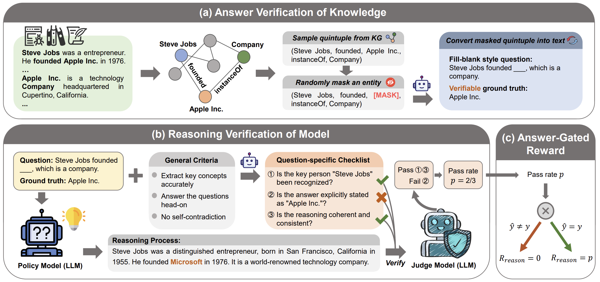

# Knowledge-to-Verification: Exploring RLVR for LLMs in Knowledge-Intensive Domains.

<details close>
<summary><b>📚 Table of Contents</b></summary>

- 📝 [What is K2V](#-what-is-k2v)
- 📌 [News](#-news)
- 🏗️ [Overview](#overview)
- 🚀 [Getting started](#-getting-started)
- 🍀 [Acknowledgements](#-acknowledgements)
- 📜 [License](#-license)
- 📖 [Citation](#-citation)

</details>

## 📝 What is K2V
K2V (Knowledge-to-Verification) is a framework for extending RLVR to knowledge-intensive domains (for example, unverifiable domains such as agriculture, law, and medicine). It builds verifiable training signals from domain corpora, validates the model's reasoning process without human supervision, and uses those signals to train LLMs.

## 📌 News
[2026.04.06] K2V has been accepted by **ACL 2026 Main Conference** (The link to the paper will be updated soon).

<a id="overview"></a>
## 🏗️ Overview

#### method
K2V extends RLVR to knowledge-intensive domains by converting unstructured domain corpora into verifiable QA pairs and by rewarding both answer correctness and reasoning quality.

K2V consists of three key components:

1. **Answer Verification of Knowledge.**  
   K2V builds a knowledge graph from raw domain corpora, samples contextual quintuples, masks one entity, and converts the masked quintuple into a fill-blank question. The name of masked entity is used as the verifiable ground-truth answer.

2. **Reasoning Verification of Model.**  
   For each QA pair, the policy model will generate a reasoning process. To verify correctness of the  reasoning process, K2V synthesizes a question-specific checklist from general reasoning criteria, and a judge model verifies the reasoning process item by item. The pass rate on the checklist provides a dense reward signals.

3. **Answer-Gated Reward Mechanism.**  
   The reasoning reward is granted only when the final answer is correct. This ensures factual correctness of reasoning procss and prevents potential reward hacking.

Together, these components allow K2V to synthesize verifiable data, evaluate reasoning processes, and train LLMs with reliable reward signals in knowledge-intensive domains.



#### Engineering implementation
K2V is organized as a single codebase with three main modules:

| Module | Purpose |
| --- | --- |
| [`graphgen-mask/`](graphgen-mask/) | Build a knowledge graph from a corpus and synthesize verifiable QA pairs. |
| [`utils/`](utils/) | Generate question-specific checklists, filter data, and convert datasets for training. |
| [`verl/`](verl/) | Framework for reinforcement learning training. |

The end-to-end workflow is:

```text
Domain corpus -> knowledge graph construction -> verifiable QA pairs synthesis-> checklist synthesis -> RL training
```

## 🚀 Getting Started

Clone the repository:

```bash
git clone https://github.com/superfarther/K2V.git
cd K2V
```

K2V uses separate environments for data synthesis and training because the
generation stage and RL stage have different dependency.

#### 1. Synthesize QA Pairs

Enter the QA synthesis module and install its dependencies:

```bash
cd graphgen-mask
conda create --name graphgen-mask python=3.10 -y
conda activate graphgen-mask
pip install -r requirements_K2V.txt
```

Deploy a synthesizer model (such as Qwen2.5-72B-Instruct) with vLLM, configure `.env`, and run the example:

```bash
vllm serve Qwen/Qwen2.5-72B-Instruct --max_model_len 32768
cp .env.example .env
bash K2V-example/run.sh
```

See [`graphgen-mask/README.md`](graphgen-mask/README.md) for details.

#### 2. Synthesize Checklist

Use the utilities module to synthesize question-specific checklist for each QA pairs and prepare the dataset for training:

```bash
cd utils
bash data_postprocess/run.sh \
    --input_file  \
    --output_dir  \
    --model_path Qwen/Qwen2.5-72B-Instruct \
    --inference_mode offline \
    --batch_size 2000 \
    --tensor_parallel_size 8 \
    --domain EN_AGRI \

python verl/convert_json_to_parquet.py
python verl/get_val_dataset.py
```

See [`utils/README.md`](utils/README.md) for details.

#### 3. RL Training

Install verl:

```bash
cd verl
conda create --name verl python=3.11 -y
conda activate verl
pip install -r requirements_K2V.txt
pip install --no-deps -e .
```

Deploy a judge model with vLLM. For example, we can use Qwen2.5-7B-Instruct as the judge model.:

```bash
CUDA_VISIBLE_DEVICES=4,5,6,7 \
vllm serve Qwen/Qwen2.5-7B-Instruct \
  --tensor-parallel-size 4 \
  --gpu_memory_utilization 0.7
```

Fill in the paths in `K2V-example/config.sh`, then start training:

```bash
bash K2V-example/config.sh
```

See [`verl/README.md`](verl/README.md) for details

## 🍀 Acknowledgements
- [Graphgen](https://github.com/InternScience/GraphGen): An efficient framework for synthesizing SFT data
- [verl](https://github.com/verl-project/verl): A Flexible and Efficient RL Post-Training Framework

## 📜 License
This project is licensed under the [Apache License 2.0](LICENSE).

## 📖 Citation
If you find this work useful, please cite:
```bibtex
@inproceedings{yuan2026knowledgetoverification,
   title = {Knowledge-to-Verification: Exploring {RLVR} for {LLM}s in Knowledge-Intensive Domains},
   author = {Yuan, Zhonghang and Wang, Zhefan and Hu, Fang and Chen, Zihong and Li, Jinzhe and Li, Gang and Ying, Jie and Kong, Huanjun and Zhang, Songyang and Dong, Nanqing},
   booktitle = {Proceedings of the 64th Annual Meeting of the Association for Computational Linguistics},
   year = {2026},
   url = {https://openreview.net/forum?id=duS4h4GK3u}
}
```